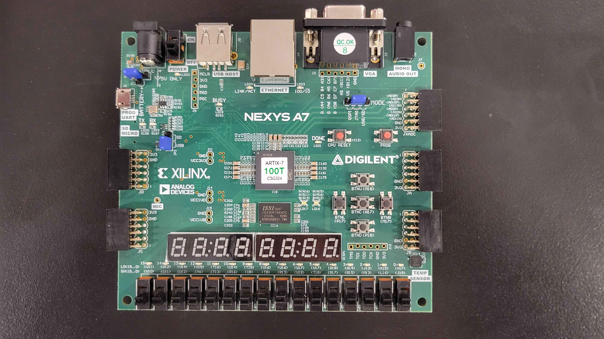
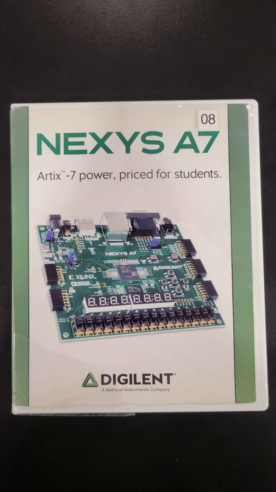
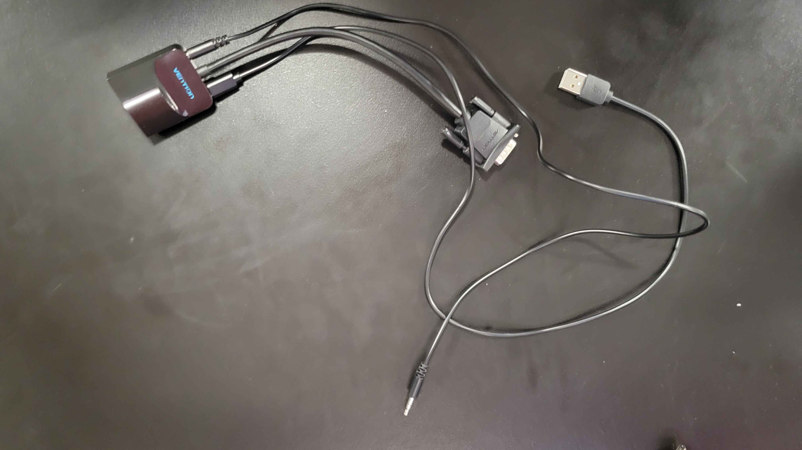
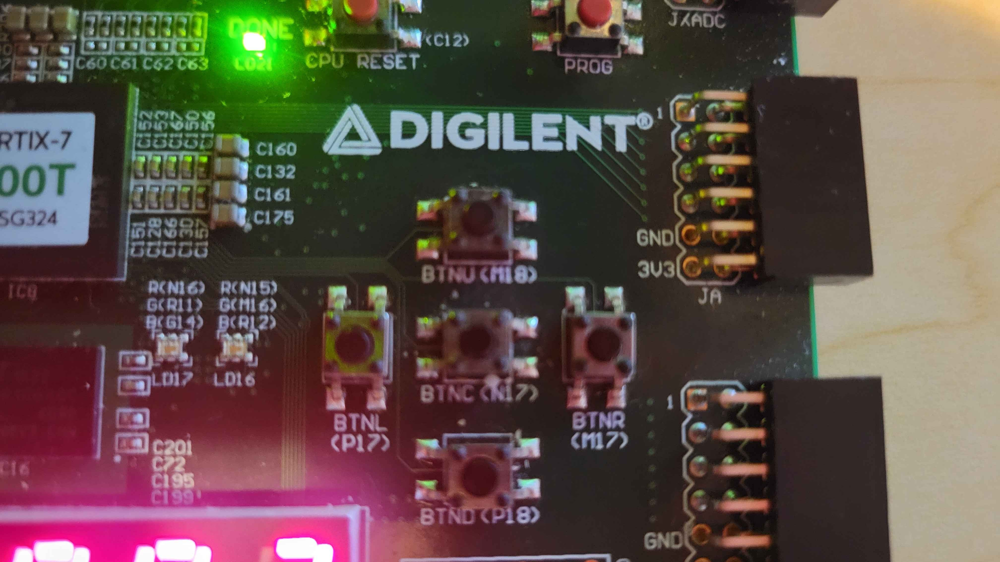

# CPE487 Final Project - Suika
A viral, addictive "drop-and-merge" puzzle game where layers drop various fruits into a container, combining matching fruits to create larger ones, aiming to create a massive watermelon without letting the fruit overflow the top. Our poster presentation PDF can be found in our 'images' folder.

## Project Behavior
---
### Software

The current functionality of this game is limited to 40 fruits. Using the left and right buttons on the FPGA board, you can aim your fruit left and right above the jar and then subsequently drop it using the up button (acting as our button drop). Every time two fruits of the same type collide, they merge into one fruit of the next type up: cherry -> strawberry -> grape -> dekopon -> persimmon -> apple -> pear -> peach -> pineapple -> melon -> watermelon. The goal is to create a watermelon. Points are awarded per merge, with larger merges worth more points, displayed on the 7-segment display. If any settled fruit crosses the game-over line near the top of the jar, the game ends and a red overlay appears. Press the center reset button at any time to start a new game

### Hardware Needed
1. Nexys A7-100T FPGA\
Board\

Board Box\

3. A device that can run Vivado
4. Micro-USB to USB-A cable
5. External Display
6. VGA, USB, and AUX to HDMI adapter\
Adapter\

## Steps to Run
1. Create a new project in Vivado. Add all of the supplementary .vhd files contained in 'Code' as design sources and all of the .xdc files as design constraints.
2. Connect a Nexys A7-100T FPGA to your device
3. Connect the FPGA board to an external display using the VGA to HDMI adapter
4. (Optional but recommended) Set max threads to speed up synthesis. In the Vivado Tcl console, run: 'set_param general.maxThreads 8'
6. Click "Run Synthesis"
7. Click "Run Implementation"
8. Click "Generate Bitstream"
9. Once complete, click "Program Device," let the system auto-connect, and the game should appear on your display after a couple seconds.

## Inputs and Outputs
### Inputs
Our project uses the following inputs:

| Button/Switch | Action |
| ------------- | ------ |
| BTNC          | Reset/new game |
| BTNU          | Drop the current fruit |
| BTNL          | Move drop position left |
| BTNR          | Move drop position right |
| SWO           | Master enable that must be up to play |

Buttons \

Switch \

BTNL and BTNR support both single tap (immediate 3-pixel move) and hold (repeat movement every 4 frames).

### Outputs
| Output | Description |
| ------------- | ------ |
| VGA          | Full 12-bit color game display at 800x600 @ 60 Hz |
| 7-Segment Display          | Running score in decimal, up to 65535 |
| LED[15]          | Lit when game over |
| LED[14]          | Lit when physics engine is busy |
| LED[7:0]           | Lower byte of score in binary |

The LED outputs were added specifically for this project as debugging aids and status indicators. These are new outputs not present in any starter or lab code.

## Summary
The initial idea came from us reminiscing our favorite simple web-based games and remembering Suika. 

Since there's not a lot of material covering a game similar to Suika in terms of physics, we had generative AI generate skeleton code for the physics engine and created the rest of the code ourselves, modifying that skeleton code as needed.

### Technical Overview
We built the project around seven VHDL modules that work together to run the game on the Nexys A7-100T. A custom clock_generator (clock_gen.vhd) steps down the board's 100 MHz oscillator down to the 40 MHz pixel clock required by the 800x60@60Hz VGA standard. The VGA timing module (vga_sync.vhd) is similar but slightly adjusted from ones from previous labs, where it generates horizontal and vertical sync pulses and tracks which pixel is currently being drawn, handing those coordinates to the renderer each clock cycle.

The physics engine (physics_engine.vhd) is the core of the project and what took us the most time. It implements Position-Based Dynamics (PBD), a simulation approach where collisions are resolved by directly correcting object positions rather than integrating forces into velocities. Each frame, the engine runs through an FSM that predicts new positions using stored velocity and gravity, enforces wall and floor constraints, resolves all fruit collisions using an octagonal distance approximation (recommended by AI-see below), and then derives the next frame's velocities from how far each object moved. To produce more stable stacking without the bouncing that happens with continuously running physics, the collision and wall pass repeats three times per frame. We handle fruit merging within the collision response: when two fruits of the same type overlap, both are deactivated and a new fruit of the next type is spawned at their midpoint

The game controller (game_controller.vhd) manages player input and game state. It detects falling edges of the VGA vertical sync signal to produce a 60 Hz frame tick, processes debounced button inputs for movement and dropping, restricts the drop position to the jar boundaries accounting for each fruit type's radius, and accumulates the running score. A random next fruit type is supplied through an lfsr (lfsr16.vhd), which was also recommended by AI, that runs a maximal-length sequence, whose output is mapped to the five smallest droppable fruit types. Button inputs are cleaned up by a dedicated debouncer (debouncer.vhd), which was a recommendation based on our previous circuits classes as well as AI and simply filters out mechanical bounce over a configurable window.

The renderer (renderer.vhd) is entirely combinational: for every pixel coordinate provided by the VGA module, it evaluates the background, jar walls, game-over line, drop preview, and all 40 active fruits in parallel within a single clock cycle. Fruit pixels are determined by the circle equation. The score is displayed on the board's built-in 7-segment display (seven_seg.vhd), which converts the 16-bit binary score to decimal digits.

### AI Use Disclosure
Generative AI was used to produce an initial skeleton for the physics engine, as well as help with troubleshooting the physics and coming up with ideas for improving the project (including the debouncer and lfsr). We wrote all other modules. We also heavily modified the physics engine throughout development (with the assistance of AI for troubleshooting) to fix simulation instability, implement the iterative solver, add the grace timer system, correct fixed-point arithmetic, and resolve the fruit-sinking and infinite-bounce bugs described in the Challenges section below. Finally, we used generative AI to help proofread the README file.

## Project in Action
Video recording:

### Gameplay
Leveling up\

Game Over\

## Conclusion

### Responsibilities
Jared Surajballi
- Created the graphics/renderer code (jar walls, game-over line, fruit rendering)
- Created the clock generator
- Transcribed the project into the README
- Assisted in modification of physics engine

Jason Yao:
- Lead developer on the physics engine modifications
- Added project video and images to the Github repository
- Contributed updated code to Github repository

Mauricio Sanchez:
- Transcribed the project into a poster format
- Recommended Position-Based Dynamics as the solution to the physics challenge
- Assisted in modification of physics engine

### Timeline
We originally started with BTD6 and pivoted, so our timeline is a little compressed:
- Week 1.5: Clock generator, VGA Sync, and basic renderer working with the jar visible on the screen
- Week 2: Game controller, debouncer, LFSR, and basic physics engine implemented. Fruits can drop and move
- Week 3: Implement the 7-segment display for score and debug physics
- Week 4: Additional physics debugging

### Challenges
The most difficult challenge was by far the physics engine. We faced an issue where the fruits would bounce nonstop on other fruits, and, when it came in contact with another dropped fruit from above that didn't immediately level it up, it would sink to the bottom of the enclosed space. We got it to its current state, where it minimally bounces.
